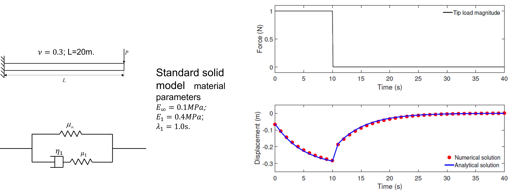

## FEM-viscoelasticity

A FEM code developed for computational mechanics. Here the viscoelasticity is solved using Simo-Hughes model.

# How to cite
Chen, Guang. "Recurrent neural networks (RNNs) learn the constitutive law of viscoelasticity." Computational Mechanics 67.3 (2021): 1009-1019. https://doi.org/10.1007/s00466-021-01981-y.
